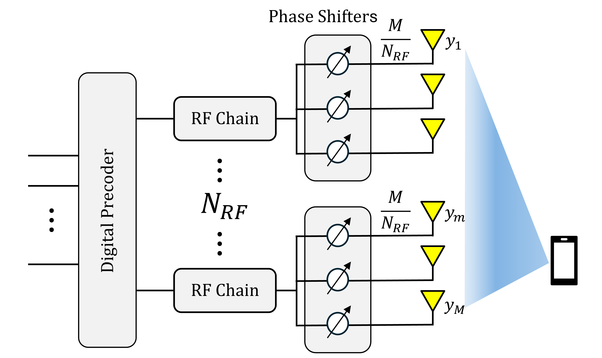
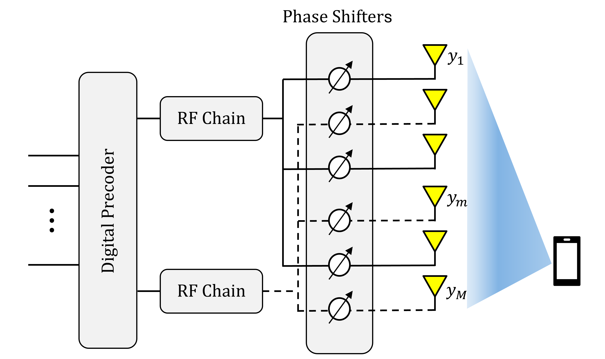
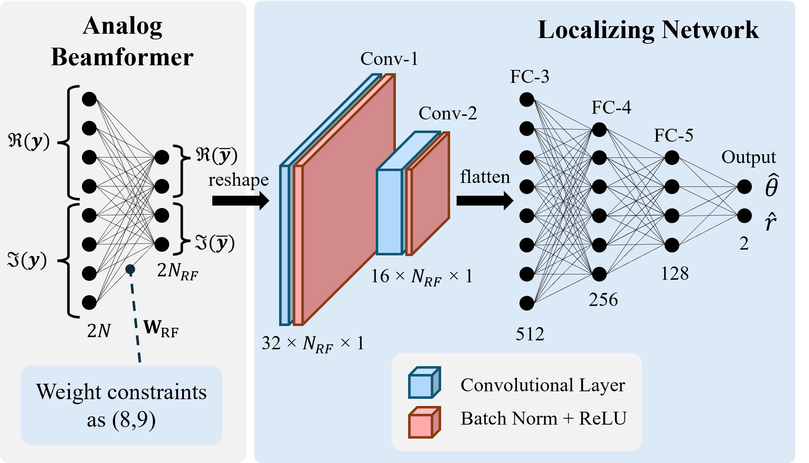

# Table of Contents
- [Introduction](#introduction)
- [Features](#features)
- [Installation](#installation)
- [Usage](#usage)
- [License](#license)
- [Acknowledgements](#acknowledgements)

# Introduction
This project introduces a learning-based approach to the near-field source localization problem using a hybrid analog-digital beamformer in an extremely large-scale multiple-input multiple-output (XL-MIMO) system. The purpose of this project is to address the gap in the literature regarding effective techniques for partially connected hybrid beamformers in near-field localization. By leveraging a Convolutional Neural Network (CNN)-based model, the project aims to design an analog beamformer with proper training constraints and estimate the single-user near-field position in a single snapshot. Our approach demonstrates superior performance over existing solutions, ensuring robustness in multipath propagation conditions, and achieving scalability with fewer RF chains compared to fully-connected architectures. Additionally, we utilize a single pilot, resulting in one-shot near-field user localization.
<p align="center">
    
    
    
</p>

# Features
- Hybrid analog-digital beamforming
- Convolutional Neural Network (CNN)-based model
- Superior performance in multipath propagation conditions
- Scalability with fewer RF chains
- Single pilot for one-shot near-field user localization


# Installation
First, initialize the conda environment:

```bash
conda env create -f environment.yml
conda activate my_env
```

Then, generate the dataset to replicate Fig. 3 and 4:

```bash
python main.py --generate_dataset 1 --dataset_size 20000 --dataset_name my_dataset
```

To generate the dataset for the multipath scenario (Fig. 5), run:

```bash
python main_multipath.py --generate_dataset 1 --dataset_size 20000 --dataset_name my_dataset_multipath
```

# Usage
Train (or Test) the CNN model for different configurations:
- `--logdir saved_models/hyb_config --train 1`
    - `--type fully-connected --model 0` (model 0: DNN, model 1: CNN)
    - `--type fully-connected --model 1`
    - `--type fully-connected --model 1`
    - `--type fully-connected --model 1`
- `--logdir saved_models/N_RF --model 1 --type sub-connected --train 1`
    - `--type sub-connected --N_RF 8`
    - `--type sub-connected --N_RF 16`
    - `--type sub-connected --N_RF 32`
    - `--type sub-connected --N_RF 64`

This is an example of training from the CLI:
```bash
python main.py --train 1 --dataset_name my_dataset --dataset_size 20000 --epochs 50 --type sub-connected --logdir saved_models/reprod  --batch_size 256 --lr 0.001 --N 128 --N_RF 8 --model 1
```

<!-- | Parameter | Values |
|-----------|--------|
| `--N_RF`  | 8, 16, 32, 64 |
| `--type`  | fully-connected, sub-connected, inter-connected |
| `--model` | 0 (DNN), 1 (CNN)|
| `--train` | 0 (Test), 1 (Tran & Test)| -->


Next, run two times the multipath CNN training: the first time set `--N_RF 16`, then `--N_RF 32`

```bash
python main_multipath.py --logdir saved_models/multipath/ --epochs 50 --N_RF 16 --train 1 --dataset_name my_dataset_multipath --type inter-connected --model 1
```

Finally, run `fully-digital.py` to generate the fully-digital solution, then`plots.m` on MATLAB to reproduce the paper figures.

# Contributing
We welcome contributions to this project! Please follow these guidelines to ensure a smooth contribution process.

## How to Contribute
1. **Fork the repository**: Click the "Fork" button at the top right of this page to create a copy of this repository in your GitHub account.
2. **Clone your fork**: Use `git clone` to clone your fork to your local machine.
    ```bash
    git clone https://github.com/mattiafabiani/One-Shot-Near-Field-Localization-with-AI-Optimized-Hybrid-Beamformer-Design.git
    ```
3. **Create a branch**: Create a new branch for your feature or bugfix.
    ```bash
    git checkout -b my-feature-branch
    ```
4. **Make your changes**: Implement your feature or bugfix.
5. **Commit your changes**: Commit your changes with a clear and descriptive commit message.
    ```bash
    git add .
    git commit -m "Description of my changes"
    ```
6. **Push to your fork**: Push your changes to your forked repository.
    ```bash
    git push origin my-feature-branch
    ```
7. **Create a Pull Request**: Go to the original repository and create a pull request from your forked repository. Provide a clear description of your changes and why they are necessary.

## Reporting Issues
If you find a bug or have a feature request, please open an issue on GitHub. Provide as much detail as possible to help us understand and address the issue.

Thank you for contributing!

# License
This project is licensed under the MIT License. If you use this project in your research, please cite our paper. For more details, see the [LICENSE](LICENSE) file.


# Acknowledgements
This work has been performed in the framework of the HORIZON-JUSNS-2022 project TIMES, grant no. 101096307, co-funded by the European Union. Views and opinions expressed are however those of the author(s) only and do not necessarily reflect those of the European Union.