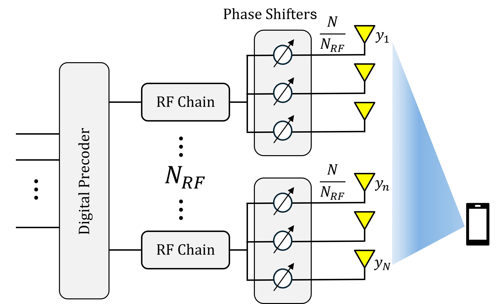

# Table of Contents
- [Introduction](#introduction)
- [Features](#features)
- [Installation](#installation)
- [Usage](#usage)
- [License](#license)
- [Acknowledgements](#acknowledgements)

# Introduction
This project introduces a learning-based approach to the near-field source localization problem using a hybrid analog-digital beamformer in an extremely large-scale multiple-input multiple-output (XL-MIMO) system. The purpose of this project is to address the gap in the literature regarding effective techniques for partially connected hybrid beamformers in near-field localization. By leveraging a Convolutional Neural Network (CNN)-based model, the project aims to design an analog beamformer with proper training constraints and estimate the single-user near-field position in a single snapshot. Our approach demonstrates superior performance over existing solutions, ensuring robustness in multipath propagation conditions, and achieving scalability with fewer RF chains compared to fully-connected architectures. Additionally, we utilize a single pilot, resulting in one-shot near-field user localization.

# Features
- Hybrid analog-digital beamforming
- Convolutional Neural Network (CNN)-based model
- Superior performance in multipath propagation conditions
- Scalability with fewer RF chains
- Single pilot for one-shot near-field user localization

# Images
<p align="center">
    
    
    
</p>

# Installation
First, initialize the conda environment:

```bash
conda env create -f environment.yml
conda activate my_env
```

Then, generate the dataset to replicate Fig. 3 and 4:

```bash
python main.py --generate_dataset 1 --dataset_size 20000 --dataset_name my_dataset
```

To generate the dataset for the multipath scenario (Fig. 5), run:

```bash
python main_multipath.py --generate_dataset 1 --dataset_size 20000 --dataset_name my_dataset_scat
```

# Usage
To run the training, use the following command:

```bash
python main.py --train 1 --dataset_name my_dataset --dataset_size 20000 --epochs 50 --type inter-connected --logdir saved_models/ --batch_size 256 --lr 0.003 --N 128 --N_RF 8 --model 1
```

| Parameter | Values |
|-----------|--------|
| `--N_RF`  | 8, 16, 32, 64 |
| `--type`  | fully-connected, sub-connected, inter-connected |
| `--model` | 0 (DNN), 1 (CNN)|
| `--train` | 0 (Test), 1 (Tran & Test)|


Next, run the multipath CNN training with the following command:

```bash
python main_multipath.py --logdir saved_models/multipath/CNN --epochs 50 --N_RF 16 --train 1 --dataset_name dataset_scat --type sub-connected --model 1
```

Finally, run `fully-digital.py` to generate the fully-digital solution, then`plots.m` on MATLAB to reproduce the paper figures.


<!-- # Contributing
Guidelines for contributing to the project. -->

# License
Information about the project's license.

# Acknowledgements
This work has been performed in the framework of the HORIZON-JUSNS-2022 project TIMES, grant no. 101096307, co-funded by the European Union. Views and opinions expressed are however those of the author(s) only and do not necessarily reflect those of the European Union.